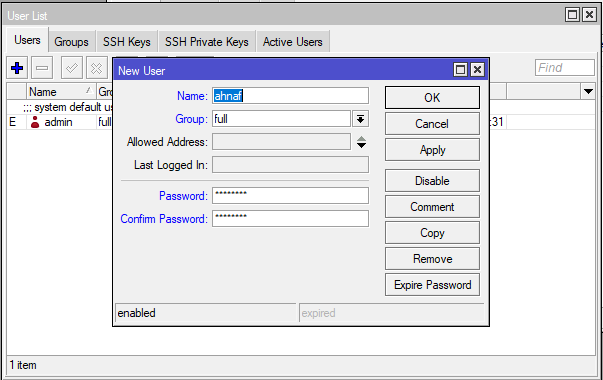

# LAB-21-Default-Routing-
Jum'at 15 Agustus 2025  
  
# Default Routing  
    
# Router 1  
1. Buat username dan password sesuai perintah di Topologi.  
     USN : ahnaf  
     PASS: Jaringan  
  
2. Login mengunakan user yang telah dibuat.  
  
  3. Ganti Identitas RB menjadi **R1**.  

         system identity set name=R1

2. Masukan ip address untuk eth1 dan eth2    
   Pilih Menu IP > Address  
   Klik +  

  
  
  

3. Konfigurasi default routing 
   Pilih menu IP > routes    
   dst-addres= ip default (0.0.0.0/0)   
   gateway= ip tujuan  
  
  
 
# Router 2
  1. Buat username dan password sesuai perintah di Topologi.  
     USN : ahnaf  
     PASS: Jaringan  
  
  2. Login mengunakan user yang telah dibuat.  
  
  3. Ganti Identitas RB menjadi **R2**.  

         system identity set name=R2  
  4. Tambahkan IP Address untuk ether1 dan ether2.  
     ether1 = 12.12.12.2/30 (untuk koneksi R2 ke R1)  
     ether2 = 23.23.23.1/30 (untuk koneksi R2 ke R3)  
  
  
  
  5. Sekarang konfigurasi static routing, **IP > route > routes**  
   
  
  

# Router 3
  1.   1. Buat username dan password sesuai perintah di Topologi.  
     USN : ahnaf  
     PASS: Jaringan  
  
  2. Login mengunakan user yang telah dibuat.  
  
  3. Ganti Identitas RB menjadi **R2**  .  

         system identity set name=R2  
  4. Tambahkan IP Address untuk ether1 dan ether2.  
ether1 = 23.23.23.2/30 (untuk koneksi R3 ke R2)  
ether2 = 33.33.33.1/29 (untuk koneksi R3 ke Laptop B)  
  
  
!g  
  5. Sekarang konfigurasi static routing, **IP > route > routes**
  
  
  

# Laptop  
  Jika semua router sudah di konfigurasi, selanjutnya kita setting IP untuk setiap laptop.  
  Laptop A = 11.11.11.2  
     
  Laptop B = 33.33.33.3  
    
  Jika sudah coba ping dari Laptop A ke B dan sebaliknya, apakah sudah terkoneksi.  
  Laptop A:  
    
  Laptop B:  
     

# Kesimpulan
  Default route ini menggunakan network 0.0.0.0 sebagai destinasinya. Network 0.0.0.0 itu bisa mencakup semua network yang memang benar-benar tidak ada di table routing, misalnya internet.  
